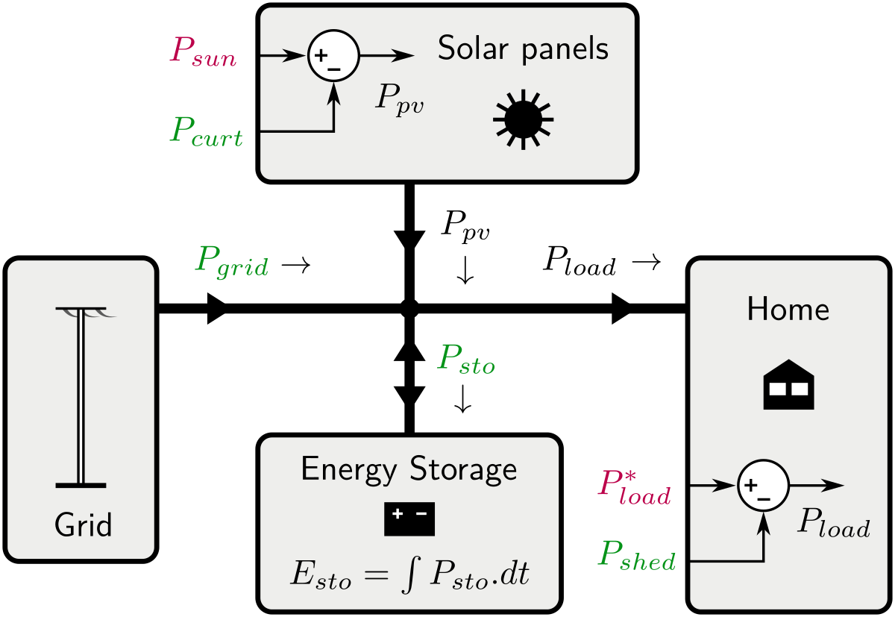

# Solar home control bench

This repository contains an open testbench for control and optimization methods for the energy management of a simple solar home.

Pierre Haessig, IETR (AUTomatic Control team), CentraleSupélec

## Solar home model

## Solar and load data

Solar production (from PV panels) and home consumption data is taken from the
[Solar home electricity dataset](http://www.ausgrid.com.au/Common/About-us/Corporate-information/Data-to-share/Solar-home-electricity-data.aspx)
by Ausgrid (distribution grid operator in the region near Sydney).

A dataset extract used for this testbench is placed in the [data](data) subfolder.
A description of this data extract is provided in [data/README.md](data/README.md). In particular, the 7 days starting at 2011-11-29 should be used for final testing:

In addition the dedicated [ausgrid-solar-data](https://github.com/pierre-haessig/ausgrid-solar-data)
repository contains much Python code to analyze the entire Ausgrid dataset. However, it should not be needed for this benchmark.
